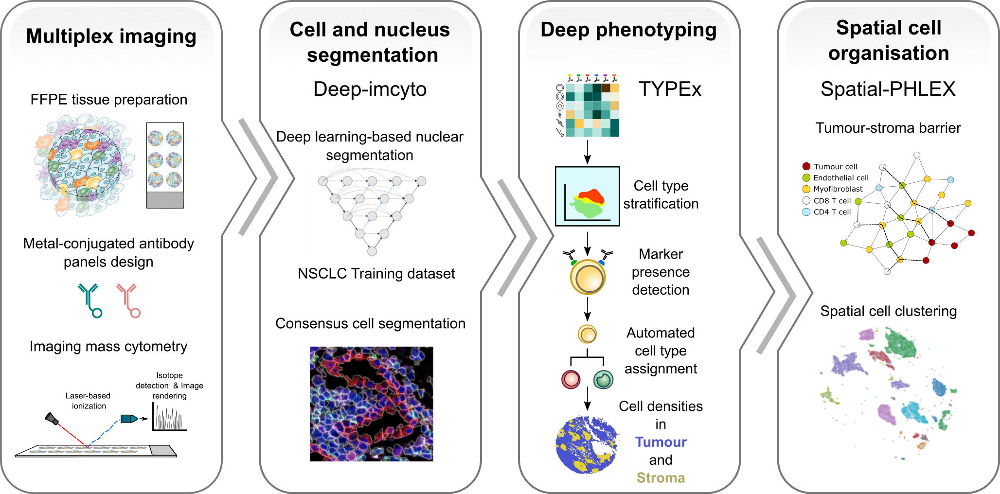

TRACERx-PHLEX: One-stop pipeline for robust and comprehensive multiplexed imaging analyses
=============

**TRACERx-PHLEX** is a user-friendly pipeline for end-to-end analysis of multiplex imaging data. See the detailed `tutorial`_ for running TRACERx-PHLEX with available options, guidelines and troubleshoothing.

.. _tutorial: https://tracerx-phlex.readthedocs.io/en/main/

It implements and automates the following integral steps for multiplexed imaging analysis:

- *segments nuclear and cell objects* (deep-imcyto)
- automatically identifies and annotates *cell types and cell states* (TYPEx)
- segments *tissue compartments* such as tumour and stroma (TYPEx)
- performs a range of *spatial analyses* (Spatial-PHLEX)

These steps are implemented as individual modules that can be run independently or as an uninterrupted fully automated end-to-end workflow (Quick start).

