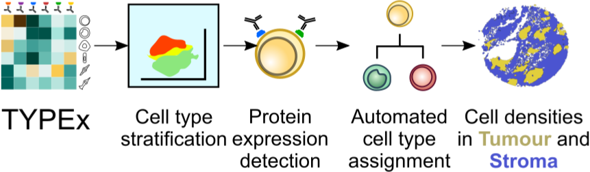

.. _TYPEx_anchor:
.. role:: bash(code)
   :language: bash
   
Deep cell phenotyping
=============
*No more hunt-and-pecking! Detecting single-cell protein expression and cell phenotyping with TYPEx*

|workflow| 

Using multiplexed imaging, TYPEx detects protein expression on single cells, annotates cell types automatically based on user-provided definitions and quantifies cell densities per tissue area. It can be customised with input parameters and configuration files, allowing it to perform an end-to-end cell phenotyping analysis without the need for manual adjustments.

Usage
=============

1. Install `Nextflow <https://www.nextflow.io/docs/latest/getstarted.html#installation>`_
2. Install `Singularity <https://www.sylabs.io/guides/3.0/user-guide/>`_ or `Docker <https://docs.docker.com/engine/installation/>`_
3. Clone the `TYPEX <https://github.com/FrancisCrickInstitute/TYPEx>`_ or the `TRACERx-PHLEX <https://github.com/FrancisCrickInstitute/TRACERx-PHLEX>`_ repository:

    .. code-block:: bash

        git clone --recursive git@github.com:FrancisCrickInstitute/TRACERx-PHLEX.git
        
        git clone git@github.com:FrancisCrickInstitute/TYPEx.git

Running TYPEx on input generated with deep-imcyto
--------------

.. code-block:: bash

   nextflow run TRACERx-PHLEX/TYPEx/main.nf \
        -c $PWD/TRACERx-PHLEX/TYPEx/test.config \
        --input_dir $PWD/results/deep-imcyto/$release/ \
        --sample_file $PWD/TRACERx-PHLEX/TYPEx/data/sample_file.tracerx.txt \
        --release $release \
        --output_dir "$PWD/results/TYPEx/$release/" \
        --params_config "$PWD/TRACERx-PHLEX/TYPEx/conf/typing_params.json" \
        --annotation_config "$PWD/TRACERx-PHLEX/TYPEx/data/cell_type_annotation.p1.json" \
        --tissue_seg_model "$PWD/TRACERx-PHLEX/TYPEx/models/tumour_stroma_classifier.ilp" \
	--color_config $PWD/TRACERx-PHLEX/TYPEx/data/celltype_colors.json \
        --deep_imcyto true --mccs true \
        -profile singularity \
        -resume

Running TYPEx with user-provided cell objects tables (indpendently of deep-imcyto)
--------------

.. code-block:: bash

   release=TYPEx_test
   nextflow run TYPEx/main.nf \
   -c $PWD/TYPEx/test.config \
    -c TYPEx/testdata.config \
    --input_dir $PWD/results/ \
    --release $release \
    --input_table $PWD/TYPEx/data/cell_objects.tracerx.txt \
    --sample_file $PWD/TYPEx/data/sample_file.tracerx.txt \
    --output_dir "$PWD/results/TYPEx/$release/" \
    --params_config "$PWD/TYPEx/data/typing_params.json" \
    --annotation_config "$PWD/TYPEx/data/cell_type_annotation.p1.json" \
    --color_config $PWD/TYPEx/data/celltype_colors.json \
    -profile singularity \
    -resume

Running TYPEx locally without high-perfomance computing server

.. code-block:: bash

	   release=TYPEx_test
	   nextflow run TYPEx/main.nf \
	   -c $PWD/TYPEx/conf/testdata.config \
	    -c TYPEx/testdata.config \
	    --input_dir $PWD/results/ \
	    --release $release \
	    --input_table $PWD/TYPEx/data/cell_objects.tracerx.txt \
	    --sample_file $PWD/TYPEx/data/sample_file.tracerx.txt \
	    --outDir "$PWD/results/TYPEx/$release/" \
	    --params_config "$PWD/TYPEx/data/typing_params.json" \
	    --annotation_config "$PWD/TYPEx/data/cell_type_annotation.json" \
		--color_config $PWD/TYPEx/data/celltype_colors.json \
	    -profile docker \
	    -resume

Input Files
==================

*Required Inputs*

- :bash:`cell_type_annotation.json` - a file with cell definitions specific to the user’s antibody panel (see :ref:`Cell type definitions`).
    Specified with :bash:`--annotationConfig` parameter.
- :bash:`sample_data.tracerx.txt`
    A tab-delimited file with information for all images (see :ref:`Sample annotation table`).
    Specified with :bash:`--sampleFile` parameter.
- :bash:`inDir` for deep-imcyto input or :bash:`inputTable` for runs independent of deep-imcyto
    Directory specified with :bash:`--inDir` parameter and input file specified with :bash:`--inputTable` parameter.
    :bash:`--inputTable` is tab-delimited file with marker intensities and cell coordiate per cell object (see :ref:`Input table`).

*Optional Inputs*

- :bash:`typing_params.json` - a config file with information on the cell typing workflow.
    A tab-delimited file with information for all images (see :ref:`Typing parameters config`).
    Specified with :bash:`--paramsConfig` parameter.
- :bash:`tissue_segmentation.json` - a file with information on tissue categories/annotation that can be overlaid to each cell object along with the cell type information.
   In  case of Tumour and Stroma tissue compartments, a summary table will also be generated with quantifications per compartment.
    Specified with :bash:`--overlayConfigFile` parameter.
- :bash:`celltype_colors.json` - color settings for the user-defined cell types.
    Specified with :bash:`--colorConfig` parameter.

Input Parameters
==================

:bash:`release` - provide a unique identifier for the run [default: PHLEX_test]
:bash:`panel` - provide a unique identifier for the panel [default: p1]
:bash:`study` - provide a unique identifier for the study [default: tracerx]

Several input paramters can be used to define the typing workflow:

- :bash:`deep-imcyto` run the TYPEx multi-tiered approach [default: true]
- :bash:`mccs` run TYPEx on deep-imcyto in MCCS mode when true and simple segmentation mode when false [default: true]

- :bash:`tiered` run the TYPEx multi-tiered approach  [default: true]
- :bash:`stratify_by_confidence` include the stratification by low and high confidence when true [default: true]
- :bash:`sampled` run TYPEx on subsampled data with three iterations when true [default: false]
- :bash:`clustered` perform clustering without any stratification [default: false]

The following parameters refer to the typing approach:

- :bash:`subtype_method` the clustering approach to be used in the last stratification step [default: FastPG]
- :bash:`major_markers` the label of the major cell type definitions in :bash:`cell_type_annotation.json` [default: major_markers]
- :bash:`subtype_markers` the label of the cell subtype definitions in :bash:`cell_type_annotation.json` [default: subtype_markers]
- :bash:`mostFreqCellType` the most frequent cell type in the cohort if known in :bash:`cell_type_annotation.json` [default: None]

    .. note:: The most frequent cell type is used to build the reference model by excluding this cell type. When it is not provided, the complete model wil be built, followed by the reference model. If provided, both will be executed in parallel. Parallel execution can make a difference in time, as these are the most time-consuming processes.

.. _Cell type definitions:

User-provided cell type definitions
-----------------------------
 
The cell-type definitions file :bash:`cell_type_annotation.json` includes a list of cell lineages and the corresponding marker proteins that together can be used to identify a cell lineage. When designing this file it is important to ensure that each cell in the cohort can be covered by these definitions. Some markers, such as CD45 and Vimentin, are expressed by multiple cell lineages. These shared proteins are used to infer a hierarchy of cell lineages, which is later considered for cell stratification and annotation. An example of a cell-type definitions file is shown below for TRACERx analyses, where we defined 13 major cell types targeted by our two antibody panels, while ensuring that each cell in the cohort can be covered by these definitions. 

.. _Input table:
Input table
-----------------------------

The input matrix has values that summarise the intensity of a protein per cell object, such as mean intensity, independently of the imaging modality or antibody tagging technique.

=============== =========== ===== ===== ============== ============ ============ ============
  ObjectNumber   imagename    X     Y        Area       <Marker 1>       ...      <Marker N>  
=============== =========== ===== ===== ============== ============ ============ ============

.. _Typing parameters config:
Typing parameters config
-----------------------------

:bash:`typing_params.json` contains the settings for clustering approaches to be used, normalisation approaches, and filtering criteria.

Key parameters that are often of interest are:
* magnitude 
As CellAssign was developed for single-cell sequencing read count data, the input protein intensity matrix should be rescaled to a range of 0 - 10^6 using the input parameter magnitude. 

* batch_effects
CellAssign also accounts for batch effects, which can be considered if provided in a sample-annotation table and specified as input parameters to TYPEx for batch correction.

.. _Sample annotation table:
Sample annotation table
-----------------------------
Provide the sample annotation table in the following format: 

============ =========================== ================== ======= =================== =================
 imagename     <experimental condition>   <Batch effect 1>    ...    <Batch effect N>      use_image
============ =========================== ================== ======= =================== =================

.. _Outputs:
Outputs
=============
TYPEx outputs summary tables that can be readily interrogated for biological questions. 
These include densities of identified cell phenotypes (cell_density_*.txt), a catalogue of the expressed proteins and combinations thereof (phenotypes.*.txt), quantified across the whole tissue area (summary_*.cell_stats.txt) or within each tissue compartment (categs_summary_*.cell_stats.txt).

.. code-block:: bash

        summary
        ├── cell_density_*.txt
        ├── cell_objects_*.txt
        ├── phenotypes.*.txt          
        ├── summary_*.cell_stats.txt
        ├── categs_summary_*.cell_stats.txt
	├── maps
	├── intensity_plots
	├── overlays

       
Troubleshooting
=============
1. **Pipeline has finished after the formatting input files (PREPROCESS) and tissue segmentation (TISSEG) processes without starting processes related to typing.**

Check whether the input cell-by-marker tables exist and are correctly specified. When using deep-imcyto as input, make sure that the deep-imcyto release matches the release specified for TYPEx.

2. **Process terminated with an error exit status (137)**

The allocated CPUs or memory are not sufficient. The computational requirements are allocated in the config file specified with the ``-c`` parameter in the script for running TYPEx, for example, ``nextflow.config`` indicated with

    .. code-block:: bash
       :emphasize-lines: 2

	nextflow run TYPEx/main.nf \
		-c <path>/nextflow.config

Open this file and adjust the maximum number of CPUs and memory in GB. By default, in the ``nextlfow.config`` file, these values are:

    .. code-block:: json-object
	
	max_cpus = 32
	max_memory = 250

The TYPEx repository includes two additional config files that can be used for smaller datasets and testing purposes: ``test.config`` and ``conf/testdata.config``.
	

3. **ERROR: Sample annotation file does not exist.**

Verify that the file specified with the argument ``–sample_file`` in the script for running TYPEx exists.

    .. code-block:: bash
       :emphasize-lines: 2

        nextflow run TYPEx/main.nf \
 		--sample_file <path>/sample_file.txt

4. **ERROR: The variables for batch effect correction specified in typing_params.json do not exist.**

Batch effect correction can be specified in the config file ``typing_params.json``, by including the names of the columns in the sample annotation file. For example, TYPEx will account for batch effects by TMA ID and staining batch defined in ``typing_params.json`` under

  .. code-block:: json-object
	
	"batch_effects":["TMA",  "antibody_batch"],

``TMA`` and ``antibody_batch`` need to be added as columns in the sample annotation file indicated with the argument ``–sample_file``. If the column names are already added in the file, make sure that the sample annotation file is in a tab-separated format.

5. **Reading cell-type annotation config /path/to/file/cell_type_annotation.json. Error in parse_con(txt, bigint_as_char) : parse error: premature EOF**

This error is linked to parsing a file in json format, most frequenty the ``cell_type_annotation.json`` file with cell lineage and subtype definitions. Make sure that every open curly bracket ``{`` is matched by a closing curly bracket ``}``. Online json format validators may also be useful.
Note, the cell type annotation file is specified in the script for running TYPEx with

.. code-block:: json-object
	
	--annotation_config "$PWD/config/cell_type_annotation.json" \

6. **Reading typing config /path/to/file/typing_params.json. Command error: Error: lexical error: invalid char in json text.**

The config file ``typing_params.json`` does not exist. Make sure that the path is correct.

7. **Error in parse_con(txt, bigint_as_char): parse error: after key and value, inside map, I expect ',' or '}'. Calls: source ... <Anonymous> -> parse_and_simplify -> parseJSON -> parse_con**

This error is linked to parsing a file in json format, most frequenty the ``cell_type_annotation.json`` file with cell lineage and subtype definitions. Check that opening square brackets are matched by a closing square bracket. Make sure that there is a comma followed by another element in the list, or a closing curly bracket to close the list. Online json format validators may also be useful.

8. **ERROR: Marker list <major_markers> not found.**

The markers specific for cell lineages and cell subtypes need to be defined as lists in the input config file cell_annotation.json file. The default names are major_markers for the major cell lineages and subtype_markers for the cell subtypes. Make sure that these names exist in the input file or specify the names of these lists by adding the following lines in the script for running TYPEx:

 .. code-block:: bash

	--major_markers 'users_major_markers’ \
	--subtype_markers 'users_subtype_markers' \

9. **ERROR: Cell type-specific markers not provided for positivity calling/**

The markers used for positivity calling are not found specified in ``typing_params.json``. By default, three markers, CD3, CD4, and CD8a are specified as follows:
	
.. code-block:: json-object
       :emphasize-lines: 3

	// Markers used for detecting expression
	  "threshold":{
	      "markers":["CD3", "CD4", "CD8a"],
	      "high_frequency":["CD3_CD4", "CD3_CD8a"],
	      "variable":["CD4"],
	      "low_frequency":["CD3"],
	      "rare":["CD8a", "CD4_CD8a", "CD3_CD4_CD8a"]
	},

10. **ERROR: The marker names defined for thresholding in typing_params.json are not in the input cell-by-marker matrix.**

At least one of the markers used for positivity calling and specified in ``typing_params.json`` could not be found among the markers in the cell-by-marker intensity matrix. Make sure that the markers specified as below by default, CD3, CD4, and CD8a have been included in the antibody panel and are correctly specified.

.. code-block:: json-object
   :emphasize-lines: 3

	// Markers used for detecting expression
	  "threshold":{
	      "markers":["CD3", "CD4", "CD8a"],
	      "high_frequency":["CD3_CD4", "CD3_CD8a"],
	      "variable":["CD4"],
	      "low_frequency":["CD3"],
	      "rare":["CD8a", "CD4_CD8a", "CD3_CD4_CD8a"]
     },

11. **ERROR: Verify that the marker combinations in typing_params.json are valid.**

At least one of the marker marker combinations used for positivity calling and specified in ``typing_params.json`` could not be found. Make sure that the marker combinations are a valid combination of the three markers, in the same order as in the ``markers`` list. For example, in the default settings for CD3, CD4, and CD8a, shown below, CD3_CD4 and CD4_CD8a are valid combinations of existing markers in the order the markers are specified, CD3, CD4 and CD8a. However, CD4_CD3 is not a valid combination, because it is not in the order they are specified. CD4_CD8 is also not a valid combination, because CD8a but not CD8 is present in the panel of markers.

.. code-block:: json-object
   :emphasize-lines: 4,5,6,7

	// Markers used for detecting expression
	  "threshold":{
	      "markers":["CD3", "CD4", "CD8a"],
	      "high_frequency":["CD3_CD4", "CD3_CD8a"],
	      "variable":["CD4"],
	      "low_frequency":["CD3"],
	      "rare":["CD8a", "CD4_CD8a", "CD3_CD4_CD8a"]
     },

12. **"ERROR: Please make sure that both models have run."**

This error occurs when the probabilistic models have not been completed, likely because the processes have been cached from a previous run. Remove the cached directory ‘work’ and restart the script for running TYPEx. 

13. **ERROR: Intensity values missing for <number of> cells. Cannot create a model with NAs for the following cell types.**

This error occurs when TYPEx has successfully run, and it is restarted with modified definitions for the major cell lineages in ``cell_type_annotation.json``. The cell subtype definitions can be modified, and TYPEx can be rerun but changing the major cell annotations is not recommended. Indicate a new release to run TYPEx with modified definitions for major cell lineages.

14. **Cell-by-marker matrix is empty.**

If using deep-imcyto as input, make sure that the metal-Ab namings is consistent across all mcd files used as input to deep-imcyto. Unless the metal-Ab names are consistent acorss the mcd files, TYPEx will consider these as different marker names. There will be no markers with definite values (non-NAs) for all cell objects.

15. **Pipeline has copmleted after the formatting input files (PREPROCESS) without starting processes related to tissue segmentation (TISSEG) processes and typing.**

Review the config file ``tissue_segmentation.json`` for any syntax errors or use an online json validator.
