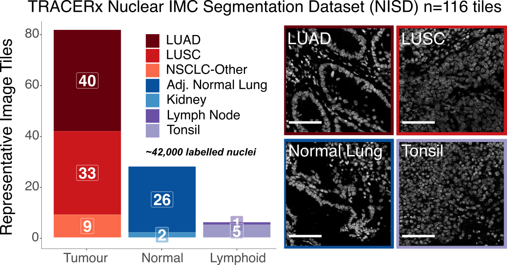
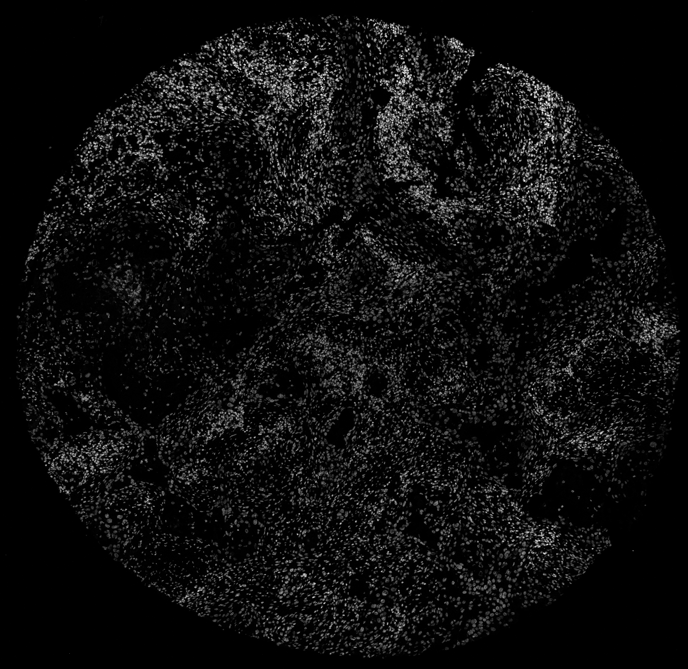

.. _imcyto_anchor:
.. role:: bash(code)
   :language: bash

Nuclear and cell segmentation
=============================
.. |deep_overview| figure:: _files/images/deep-imcyto_overview.png
        :width: 800
        :alt: deep-imcyto pipeline overview.

        Overview of the processing options available in deep-imcyto.

**deep-imcyto** is the first constituent module of :doc:`TRACERx-PHLEX <index>`. It is a standalone bioinformatics analysis pipeline for nucleus and cellular segmentation, measurement and other principal tasks in imaging mass cytometry (IMC) data analysis. It is an update and extension of `nfcore/imcyto <https://nf-co.re/imcyto>`_, a bioinformatics analysis pipeline developed by `van Maldegem et al <https://doi.org/10.1038/s41467-021-26214-x>`_. for IMC image segmentation and extraction of single cell expression data. As such running deep-imcyto should be familiar to users of nfcore/imcyto. **deep-imcyto** provides **highly accurate cell segmentation of IMC images** based on a U-net++ deep learning model as well as **facilities for QC and manual review** of image processing steps, which can be invaluable during IMC experimental design. See :ref:`deep-imcyto Example Usage` for how to get started with deep-imcyto on your system. 

Under the hood, deep-imcyto uses a U-Net++ deep-learning architecture trained on the :ref:`TRACERx nuclear IMC segmentation dataset <Appendix: TRACERx nuclear IMC segmentation dataset>`, consisting of 40,000+ nuclei from IMC images of lung and other tissue types. A representative segmentation is shown in the figure below.

deep-imcyto is implemented in `Nextflow <https://www.nextflow.io>`_, a workflow tool to run tasks across multiple compute infrastructures in a very portable manner. It comes with docker containers making installation trivial and results highly reproducible.

.. |deep_jellybean| figure:: _files/images/deep-imcyto_jellybean.png
        :width: 800
        :alt: deep-imcyto pipeline overview.

        Representative segmentation of an IMC tissue microarray image with the deep-imcyto `simple` workflow. Segmentation masks are overlaid on nuclei. The `simple` workflow is designed to provide a quick and dirty segmentation of whole cells for downstream analysis. The `MCCS` workflow provides a more accurate segmentation of whole cells by building on the accurate nuclear predictions of the core deep-imcyto model.

Workflow options
================
deep-imcyto provides three primary workflow options for raw IMC data:
    -  :ref:`QC`: quality control of raw IMC data.
    -  :ref:`Simple segmentation`: segmentation of nuclei with the deep-imcyto nucleus segmentation model, followed by pixel expansion to approximate cellular boundaries.
    -  :ref:`MCCS` / CellProfiler segmentation: segmentation of nuclei with the deep-imcyto nucleus segmentation model, followed by execution of a custom `CellProfiler <https://cellprofiler.org/>`_ pipeline designed to take nuclear predictions as input.

.. _QC:

Workflow 1: QC
--------------

.. |QC_fig| figure:: _files/images/qc_mode.png
        :width: 800
        :alt: Overview of the QC workflow of deep-imcyto.

        Overview of the QC workflow of deep-imcyto. Preprocessing and Spillover compensation stages are optional and user configurable.

deep-imcyto's QC mode is designed to provide quick access to individual channels in IMC data for quality control and/or review by splitting .mcd files into constituent channel images by imaged ROI. If a particular preprocessing option is selected (e.g. `spillover correction`, `hotpixel removal` or the application of a custom set of preprocessing steps specified as a CellProfiler `.cppipe` file) then this preprocessing will be performed, and produced as an output of the QC run for manual review.

.. _Simple segmentation:

Workflow 2: Simple segmentation
-------------------------------

In `simple` segmentation mode an approximation of whole cell segmentation is performed where accurate predicted nuclei are dilated by a user-defined number of pixels. Simple cell segmentaiton produces a segmentation mask for every cell in each image, performs a basic set of measurements of marker intensity and morphometry, and produces a set of summary single cell spatial plots of mean, standard deviation and median marker intensity, enabling the user to quickly gain insight into the spatial distribution of particular protein markers. A table of the nearest spatial neighbours of every cell object is also produced for downstream nearest-neighbour analysis.

.. |simple_marker_plots| figure:: _files/images/simple_seg_marker_plots.png
        :width: 800
        :alt: Example single cell spatial plots of mean marker intensity produced by the simple segmentation workflow.

        Example single cell spatial plots of mean marker intensity produced by the simple segmentation workflow.

.. _MCCS:

Workflow 3: Multiplexed consensus cell segmentation
---------------------------------------------------
Multiplexed consensus cell segmentation (MCCS) is a classical image processing-based method developed in the Swanton lab for segmenting whole cells in IMC data by building on the accurate nuclear predictions of the core deep-imcyto model.

In `MCCS` mode a more accurate whole cell segmentation is performed following the multiplexed consensus cell segmentation principles using nuclear predictions and progressive masking of specific marker channels (See [LINK TO PAPER]). MCCS procedures are provided to deep-imcyto as a CellProfiler pipeline which is then executed in parallel via Nextflow. MCCS utilises experimenter knowledge about cell lineages and marker expression to improve whole cell segmentation across cell types in complex tissues. See :ref:`Developing a multiplexed consensus cell segmentation pipeline` for more information on how to develop an MCCS pipeline for your own IMC panel.

.. _deep-imcyto Example Usage:

Example usage
=============
deep-imcyto is designed with HPC systems in mind due to the high processing requirements of large scale IMC cohorts. However it may be run outside of this context, provided the user has access to a CUDA-enabled GPU. 

Running deep-imcyto on an HPC system running SLURM
--------------------------------------------------

.. note::

    The example below assumes that you have Nextflow (version 22.04.0) and Singularity (version 3.6.4) installed on your system. Your mileage may vary with earlier versions.

1. First, clone the `TRACERx-PHLEX repository <https://github.com/FrancisCrickInstitute/TRACERx-PHLEX>`_ from github:

    .. code-block:: bash

        git clone --recursive git@github.com:FrancisCrickInstitute/TRACERx-PHLEX.git

2. Download the `pre-trained model weights <https://doi.org/10.5281/zenodo.7573269>`_ for prediction of nuclei using the U-Net++ model:

    .. image:: https://zenodo.org/badge/DOI/10.5281/zenodo.7665181.svg
        :target: https://doi.org/10.5281/zenodo.7665181

3. Unzip the files and move ``boundaries.hdf5``, ``edge_weighted_nuc.hdf5``, ``COM.hdf5``, ``AE_weights.hdf5`` and ``nuclear_morph_scaler.pkl`` to a suitable directory.

4. deep-imcyto can then be run from a bash wrapper in the deep-imcyto root directory as follows:

Running deep-imcyto in ``MCCS`` mode
+++++++++++++++++++++++++++++++++++++++

.. code-block:: bash

    #!/bin/bash

    ## LOAD MODULES
    ml purge
    ml Nextflow/22.04.0
    ml Singularity/3.6.4

    # export cache directory for singularity
    export NXF_SINGULARITY_CACHEDIR='/path/to/cachedir/'

    ## RUN PIPELINE
    nextflow run ./main.nf\
        --input "/path/to/mcd.mcd"\
        --outdir '../results'\
        --metadata '/path/to/metadata.csv'\
        --full_stack_cppipe './assets/cppipes/full_stack_preprocessing.cppipe'\
        --segmentation_cppipe './assets/cppipes/segmentationP1.cppipe'\
        --compensation_tiff './assets/spillover/P1_imc*.tiff'\
        --plugins "/path/to/plugins"\
        --nuclear_weights_directory "/path/to/weights"\
        --segmentation_workflow 'consensus'\
        --nuclear_dilation_radius 5\
        -profile crick\
        -resume

Running deep-imcyto in ``simple`` mode
+++++++++++++++++++++++++++++++++++++++

.. code-block:: bash

    #!/bin/bash

    ## LOAD MODULES
    ml purge
    ml Nextflow/22.04.0
    ml Singularity/3.6.4

    # Define folder for deep-imcyto software containers to be stored:
    export NXF_SINGULARITY_CACHEDIR='/path/to/cachedir/'

    # RUN PIPELINE:
    nextflow run ./main.nf\
        --input "/camp/path/to/data/my_image.mcd"\
        --outdir '/camp/path/to/results'\
        --metadata '/camp/path/to/channel_metadata_deepimcyto.csv'\
        --nuclear_weights_directory "/camp/path/to/weights"\ # The path to the directory containing the neural network weights.
        --segmentation_workflow 'simple'\
        --nuclear_dilation_radius 5\
        --preprocess_method 'hotpixel'\
        --email username@crick.ac.uk\
        -profile crick\
        -w '/path/to/work/directory' # Path to a suitable directory where the nextflow will save working/interim files e.g. lab scratch directory.

.. note::

    The Singularity container required by deep-imcyto is fairly large (~6GB). It will be built automatically by Nextflow the first the pipeline is run, but this may take some time. Please ensure you have sufficient memory on the local system on which Nextflow is being run to allow the build to complete.

Input Files
==================
Required inputs
---------------
- :bash:`*.mcd`, :bash:`*.txt` or :bash:`*.ome.tiff` images
    Input image files in `mcd` or `ome.tiff` format.
    Specified with :bash:`--input` flag.
- :bash:`metadata.csv`
    A plaintext, delimited file containing isotope metadata for each image file (see :ref:`The deep-imcyto metadata file`).
    Specified with :bash:`--metadata` flag.
- :bash:`weights` files for neural network models
    - ``boundaries.hdf5`` 
    - ``edge_weighted_nuc.hdf5``
    - ``COM.hdf5``
    - ``AE_weights.hdf5``
    - ``nuclear_morph_scaler.pkl``
    Directory specified with :bash:`--nuclear_weights_directory` flag containing the above files.

Workflow-dependent inputs
--------------------------
- :bash:`*.cppipe` files
    CellProfiler pipeline files for performing CellProfiler-based workflows.
    Specified with :bash:`--mccs_stack_cppipe`, :bash:`--full_stack_cppipe` and :bash:`--segmentation_cppipe` flags, as needed.
- Spillover matrix in :bash:`.tiff` format
    A spillover tiff image file for compensation of isotope channel spillover. See `*Chevrier et al (2018)* <https://doi.org/10.1016/j.cels.2018.02.010>`_ and `this repository from the Bodenmiller group <https://github.com/BodenmillerGroup/cyTOFcompensation>`_ for details. Specified with  :bash:`--compensation_tiff` flag.
- :bash:`plugins` directory
    A directory containing the CellProfiler plugins required for MCCS. Specified with :bash:`--plugins` flag.
    
    .. note:: These plugins are bundled with the deep-imcyto repository, and are not required if MCCS is not used.

The deep-imcyto metadata file
-----------------------------
The metadata file is a comma-delimited file containing information about the isotope channels in the input image files. 
A full example of the contents of this file is shown in the table below (:ref:`Example metadata file for deep-imcyto`).

The first column is the name of the isotope channel. This should be the same as the name of the corresponding channel in the input image files. The subsequent columns contain binary values and represent whether a particular IMC isotope channel image should be used in a given set of deep-imcyto's processes. This can be one of the following:

    * :bash:`full_stack` - The isotope channels will be used in the full-stack workflow.
    * :bash:`mccs_stack` - The isotope channels to be used in the MCCS workflow.
    * :bash:`nuclear` - The isotope channels to be used to construct the nuclear image for nuclear segmentation processes.
    .. note:: At present the nuclear segmentation process uses a maximum of 2 isotope channels. If more than 2 isotope channels are specified as `nuclear` then the first 2 will be used.
    * :bash:`spillover` - The isotope channels to be used in the spillover correction workflow.
    .. note:: The number of spillover channels specified must be exactly equal to the number of rows/columns in the spillover matrix.
    * :bash:`counterstain` - The isotope channels will be used to create the counterstain image to generate pseudo-H&Es.
    .. note:: This can be any number of channels, but it is recommended to leave out purely nuclear markers (e.g. 191Ir) as these will not be useful for pseudo-H&E generation.
.. warning:: All segmentation workflows require the `full_stack` and `nuclear` columns to be correctly specified in the `metadata.csv`.

.. table:: Example metadata file for deep-imcyto
    
    +--------+------------+------------+---------+-----------+--------------+
    | metal  | full_stack | mccs_stack | nuclear | spillover | counterstain |
    +========+============+============+=========+===========+==============+
    | 80ArAr | 1          | 0          | 0       | 0         | 0            |
    +--------+------------+------------+---------+-----------+--------------+
    | 100Ru  | 1          | 0          | 0       | 0         | 0            |
    +--------+------------+------------+---------+-----------+--------------+
    | 131Xe  | 1          | 0          | 0       | 0         | 0            |
    +--------+------------+------------+---------+-----------+--------------+
    | 134Xe  | 1          | 0          | 0       | 0         | 0            |
    +--------+------------+------------+---------+-----------+--------------+
    | 141Pr  | 1          | 0          | 0       | 1         | 1            |
    +--------+------------+------------+---------+-----------+--------------+
    | 142Nd  | 1          | 0          | 0       | 1         | 1            |
    +--------+------------+------------+---------+-----------+--------------+
    | 143Nd  | 1          | 0          | 0       | 1         | 1            |
    +--------+------------+------------+---------+-----------+--------------+
    | 144Sm  | 1          | 0          | 0       | 1         | 1            |
    +--------+------------+------------+---------+-----------+--------------+
    | 145Nd  | 1          | 0          | 0       | 1         | 1            |
    +--------+------------+------------+---------+-----------+--------------+
    | 146Nd  | 1          | 0          | 0       | 1         | 1            |
    +--------+------------+------------+---------+-----------+--------------+
    | 147Sm  | 1          | 0          | 0       | 1         | 1            |
    +--------+------------+------------+---------+-----------+--------------+
    | 148Nd  | 1          | 0          | 0       | 1         | 1            |
    +--------+------------+------------+---------+-----------+--------------+
    | 149Sm  | 1          | 0          | 0       | 1         | 1            |
    +--------+------------+------------+---------+-----------+--------------+
    | 150Nd  | 1          | 0          | 0       | 1         | 1            |
    +--------+------------+------------+---------+-----------+--------------+
    | 151Eu  | 1          | 0          | 0       | 1         | 1            |
    +--------+------------+------------+---------+-----------+--------------+
    | 152Sm  | 1          | 0          | 0       | 1         | 1            |
    +--------+------------+------------+---------+-----------+--------------+
    | 153Eu  | 1          | 0          | 0       | 1         | 1            |
    +--------+------------+------------+---------+-----------+--------------+
    | 154Sm  | 1          | 0          | 0       | 1         | 1            |
    +--------+------------+------------+---------+-----------+--------------+
    | 155Gd  | 1          | 0          | 0       | 1         | 1            |
    +--------+------------+------------+---------+-----------+--------------+
    | 156Gd  | 1          | 0          | 0       | 1         | 1            |
    +--------+------------+------------+---------+-----------+--------------+
    | 158Gd  | 1          | 0          | 0       | 1         | 1            |
    +--------+------------+------------+---------+-----------+--------------+
    | 159Tb  | 1          | 0          | 0       | 1         | 1            |
    +--------+------------+------------+---------+-----------+--------------+
    | 160Gd  | 1          | 0          | 0       | 1         | 1            |
    +--------+------------+------------+---------+-----------+--------------+
    | 161Dy  | 1          | 0          | 0       | 1         | 1            |
    +--------+------------+------------+---------+-----------+--------------+
    | 162Dy  | 1          | 0          | 0       | 1         | 1            |
    +--------+------------+------------+---------+-----------+--------------+
    | 163Dy  | 1          | 0          | 0       | 1         | 1            |
    +--------+------------+------------+---------+-----------+--------------+
    | 164Dy  | 1          | 0          | 0       | 1         | 1            |
    +--------+------------+------------+---------+-----------+--------------+
    | 165Ho  | 1          | 0          | 0       | 1         | 1            |
    +--------+------------+------------+---------+-----------+--------------+
    | 166Er  | 1          | 0          | 0       | 1         | 1            |
    +--------+------------+------------+---------+-----------+--------------+
    | 167Er  | 1          | 0          | 0       | 1         | 1            |
    +--------+------------+------------+---------+-----------+--------------+
    | 168Er  | 1          | 0          | 0       | 1         | 1            |
    +--------+------------+------------+---------+-----------+--------------+
    | 169Tm  | 1          | 0          | 0       | 1         | 1            |
    +--------+------------+------------+---------+-----------+--------------+
    | 170Er  | 1          | 0          | 0       | 1         | 1            |
    +--------+------------+------------+---------+-----------+--------------+
    | 171Yb  | 1          | 0          | 0       | 1         | 1            |
    +--------+------------+------------+---------+-----------+--------------+
    | 172Yb  | 1          | 0          | 0       | 1         | 1            |
    +--------+------------+------------+---------+-----------+--------------+
    | 173Yb  | 1          | 0          | 0       | 1         | 1            |
    +--------+------------+------------+---------+-----------+--------------+
    | 174Yb  | 1          | 0          | 0       | 1         | 1            |
    +--------+------------+------------+---------+-----------+--------------+
    | 175Lu  | 1          | 0          | 0       | 1         | 1            |
    +--------+------------+------------+---------+-----------+--------------+
    | 176Yb  | 1          | 0          | 0       | 1         | 1            |
    +--------+------------+------------+---------+-----------+--------------+
    | 191Ir  | 1          | 0          | 1       | 0         | 0            |
    +--------+------------+------------+---------+-----------+--------------+
    | 193Ir  | 1          | 0          | 1       | 0         | 0            |
    +--------+------------+------------+---------+-----------+--------------+

Autogenerate the metadata file (experimental)
---------------------------------------------
deep-imcyto provides an inbuilt method to automatically generate the metadata file for a given input image. This process relies on the marker channels of the input IMC image having channel names that are separated from isotope tags by an underscore in the `.mcd` or `.tiff` file metadata, for example: `150Nd_PDL1`, `164Dy_PanCK` etc. This process option is experimental and may not work for all IMC datasets. 

To use this method, set the flag :bash:`--autogenerate_metadata true` in the deep-imcyto run command. The script will then attempt to autogenerate the metadata file for the input images. This can be useful if there have been changes to the antibody panel during the scanning of an experimental cohort (e.g. if a marker was changed for an alternative due to poor staining), whcih would otherwise require the cohort to be processed separetly with two or more distinct metadata files. If the script is unable to autogenerate the metadata file, it will exit with an error message and the user will need to manually specify the metadata file. 

Using the autogenerate option may increased your sample processing times, particularly for `.mcd` input files as a large amount of data is read from the `.mcd` file twice, first in order to generate the metadata file, then to process the file's contents with the metadata input. If this is a concern, it is recommended to generate the metadata file manually and specify it with the :bash:`--metadata` flag.

Outputs
==================

In this section we explain the expected outputs of each deep-imcyto process.  Overall output from deep-imcyto has the following directory structure:

.. code-block:: bash

   results
   ├── channel_preprocess
   ├── consensus_cell_segmentation / simple_segmentation
   ├── imctools          
   ├── nuclear_preprocess        
   ├── nuclear_segmentation
   ├── pipeline_info
   └── pseudo_HandE

Below we explain the output of each particular deep-imcyto process in the approximate order they are produced by Nextflow, and the specific contents of each of these directories.

Pipeline info
-------------

imctools
--------
    Raw tiff channel images, split into substacks for each identifier in the metadata (if :bash:`--save_all_stacks` parameter is set to :bash:`true`).
    
    .. code-block:: bash

        imctools
        ├── full_stack
        ├── mccs_stack
        ├── nuclear          
        ├── spillover        
        ├── counterstain

Preprocessed channel images in :bash:`.tiff` format.
----------------------------------------------------
    Preprocessing depends on the type of preprocessing specified with the :bash:`--preprocessing` flag:
    - :bash:`--preprocessing 'cellprofiler'`
        CellProfiler-based preprocessing of channel images.
    - :bash:`--preprocessing 'hotpixel'`
        Remove hot pixels from channel images only.`
    - :bash:`--preprocessing 'none'`
        No additional channel preprocessing.`

Preprocessed nuclear images
---------------------------

Preprocessed images in :bash:`.png` format for input into the nuclear segmentation workflow.

    A preprocessed nuclear image output by the deep-imcyto's nuclear preprocessing workflow.

Nuclear segmentation
--------------------

Nuclear segmentation process outputs have the following directory structure:

.. code-block:: bash

    nuclear_segmentation/
    ├── postprocess_predictions
    └── raw
        ├── AE_error
        ├── boundaries
        ├── com
        ├── edge_weighted_nuc
        └── pbw_wshed_nc_0.5_cc_0.5_mos_4_c_0

Raw predictions
+++++++++++++++

{boundaries\|com\|edge_weighted_nuc}
~~~~~~~~~~~~~~~~~~~~~~~~~~~~~~~~~~~~~
    Raw semantic predictions from the deep-imcyto U-net++ model of the three core components of the nuclear segmentation workflow: boundaries, center of mass, and edge weighted nucleus.

AE_error
~~~~~~~~
    Autoencoder error image for the initial nucleus masks produced through marker-controlled watershed of the three classes of semantic prediction images.

postprocess_predictions
+++++++++++++++++++++++
    Postprocessed nuclear segmentation masks in :bash:`.tiff` format.

Pseudo H&E images
--------------------
Resultant pseudo H&E images from the :bash:`pseudo_HE` workflow, in :bash:`.png` format.

.. figure:: _files/images/pseudoHE.png
    :width: 800
    :alt: A pseudo H&E image output by the deep-imcyto's pseudo H&E workflow.

    A pseudo H&E image output by the deep-imcyto's pseudo H&E workflow.

Whole cell segmentation
------------------------

.. note::

    The name of the :bash:`cell_segmentation` directory will vary depending on which :bash:`--segmentation_type` is specified.

MCCS outputs
++++++++++++

Simple segmentation outputs
+++++++++++++++++++++++++++

Parameters
============

.. note::
    
    Default parameters are specified in the :bash:`nextflow.config` file. Default parameters can be overridden by specifying the parameter in the command line. e.g. to change the default 
    value by which predicted nucleus masks are dilated by in the :bash:`simple` workflow of deep-imcyto to 10 pixels (from a default of 5), the following flag should be added to the run command:
    
        .. code-block:: bash
        
            nextflow run main.nf --nuclear_dilation_radius 10

.. table:: Full list of specifiable parameters in deep-imcyto
    
    +--------------------------------------+-----------------------------------------------------------------------------------------------------------------------------------------------------------------------------------------------------------------------------------------------------+-------------------------------------------------------------------------------------+
    |              Parameter               |                                                                                                                     Description                                                                                                                     |                                       Default                                       |
    +======================================+=====================================================================================================================================================================================================================================================+=====================================================================================+
    | :bash:`--clusterOptions`             |                                                                                                                                                                                                                                                     | false                                                                               |
    +--------------------------------------+-----------------------------------------------------------------------------------------------------------------------------------------------------------------------------------------------------------------------------------------------------+-------------------------------------------------------------------------------------+
    | :bash:`--compensation_method`        |                                                                                                                                                                                                                                                     | 'NNLS'                                                                              |
    +--------------------------------------+-----------------------------------------------------------------------------------------------------------------------------------------------------------------------------------------------------------------------------------------------------+-------------------------------------------------------------------------------------+
    | :bash:`--compensation_tiff`          |                                                                                                                                                                                                                                                     | false                                                                               |
    +--------------------------------------+-----------------------------------------------------------------------------------------------------------------------------------------------------------------------------------------------------------------------------------------------------+-------------------------------------------------------------------------------------+
    | :bash:`--config_profile_contact`     |                                                                                                                                                                                                                                                     | false                                                                               |
    +--------------------------------------+-----------------------------------------------------------------------------------------------------------------------------------------------------------------------------------------------------------------------------------------------------+-------------------------------------------------------------------------------------+
    | :bash:`--config_profile_description` |                                                                                                                                                                                                                                                     | false                                                                               |
    +--------------------------------------+-----------------------------------------------------------------------------------------------------------------------------------------------------------------------------------------------------------------------------------------------------+-------------------------------------------------------------------------------------+
    | :bash:`--config_profile_url`         |                                                                                                                                                                                                                                                     | false                                                                               |
    +--------------------------------------+-----------------------------------------------------------------------------------------------------------------------------------------------------------------------------------------------------------------------------------------------------+-------------------------------------------------------------------------------------+
    | :bash:`--custom_config_base`         |                                                                                                                                                                                                                                                     | "https://raw.githubusercontent.com/nf-core/configs/${params.custom_config_version}" |
    +--------------------------------------+-----------------------------------------------------------------------------------------------------------------------------------------------------------------------------------------------------------------------------------------------------+-------------------------------------------------------------------------------------+
    | :bash:`--custom_config_version`      | Use a custom config file.                                                                                                                                                                                                                           | 'master'                                                                            |
    +--------------------------------------+-----------------------------------------------------------------------------------------------------------------------------------------------------------------------------------------------------------------------------------------------------+-------------------------------------------------------------------------------------+
    | :bash:`--email`                      | Send an email when the pipeline finishes.                                                                                                                                                                                                           | true                                                                                |
    +--------------------------------------+-----------------------------------------------------------------------------------------------------------------------------------------------------------------------------------------------------------------------------------------------------+-------------------------------------------------------------------------------------+
    | :bash:`--email_on_fail`              | Send an email if the pipeline fails to execute.                                                                                                                                                                                                     | false                                                                               |
    +--------------------------------------+-----------------------------------------------------------------------------------------------------------------------------------------------------------------------------------------------------------------------------------------------------+-------------------------------------------------------------------------------------+
    | :bash:`--full_stack_cppipe`          | Path to the CellProfiler pipeline which performs MCCS.                                                                                                                                                                                              | false                                                                               |
    +--------------------------------------+-----------------------------------------------------------------------------------------------------------------------------------------------------------------------------------------------------------------------------------------------------+-------------------------------------------------------------------------------------+
    | :bash:`--help`                       |                                                                                                                                                                                                                                                     | false                                                                               |
    +--------------------------------------+-----------------------------------------------------------------------------------------------------------------------------------------------------------------------------------------------------------------------------------------------------+-------------------------------------------------------------------------------------+
    | :bash:`--hostnames`                  |                                                                                                                                                                                                                                                     | false                                                                               |
    +--------------------------------------+-----------------------------------------------------------------------------------------------------------------------------------------------------------------------------------------------------------------------------------------------------+-------------------------------------------------------------------------------------+
    | :bash:`--ilastik_training_ilp`       | Legacy nf-core/imcyto param.                                                                                                                                                                                                                        | false                                                                               |
    +--------------------------------------+-----------------------------------------------------------------------------------------------------------------------------------------------------------------------------------------------------------------------------------------------------+-------------------------------------------------------------------------------------+
    | :bash:`--input`                      | Path to the input image files in `.mcd`, `.tiff`. `.ome.tiff` or `.txt` format. Path can include wildcards * to pass multiple images to the pipeline. e.g. `data/*.mcd``                                                                            |                                                                                     |
    +--------------------------------------+-----------------------------------------------------------------------------------------------------------------------------------------------------------------------------------------------------------------------------------------------------+-------------------------------------------------------------------------------------+
    | :bash:`--mccs_stack_cppipe`          | Path to the MCCS preprocessing cppipe file that is used in the MCCS branch of dee-imcyto.                                                                                                                                                           | false                                                                               |
    +--------------------------------------+-----------------------------------------------------------------------------------------------------------------------------------------------------------------------------------------------------------------------------------------------------+-------------------------------------------------------------------------------------+
    | :bash:`--metadata`                   | Path to a comma-delimited file indicating which IMC isotope channels from the IMC image are to be used in which deep-imcyto processes.                                                                                                              | './metadata.csv'                                                                    |
    +--------------------------------------+-----------------------------------------------------------------------------------------------------------------------------------------------------------------------------------------------------------------------------------------------------+-------------------------------------------------------------------------------------+
    | :bash:`--monochrome_logs`            |                                                                                                                                                                                                                                                     | false                                                                               |
    +--------------------------------------+-----------------------------------------------------------------------------------------------------------------------------------------------------------------------------------------------------------------------------------------------------+-------------------------------------------------------------------------------------+
    | :bash:`--n_neighbours`               | Number of nearest cells to be counted as neighbours in the deep-imcyto `simple` segmentation workflow.                                                                                                                                              | 5                                                                                   |
    +--------------------------------------+-----------------------------------------------------------------------------------------------------------------------------------------------------------------------------------------------------------------------------------------------------+-------------------------------------------------------------------------------------+
    | :bash:`--name`                       | Use a custom Nextflow run name.                                                                                                                                                                                                                     | false                                                                               |
    +--------------------------------------+-----------------------------------------------------------------------------------------------------------------------------------------------------------------------------------------------------------------------------------------------------+-------------------------------------------------------------------------------------+
    | :bash:`--nuclear_weights_directory`  | The path on the sysem to the directory where the deep-imcyto neural network weights are saved.                                                                                                                                                      | './weights'                                                                         |
    +--------------------------------------+-----------------------------------------------------------------------------------------------------------------------------------------------------------------------------------------------------------------------------------------------------+-------------------------------------------------------------------------------------+
    | :bash:`--outdir`                     | Path to the output directory.                                                                                                                                                                                                                       | './results'                                                                         |
    +--------------------------------------+-----------------------------------------------------------------------------------------------------------------------------------------------------------------------------------------------------------------------------------------------------+-------------------------------------------------------------------------------------+
    | :bash:`--plaintext_email`            |                                                                                                                                                                                                                                                     | false                                                                               |
    +--------------------------------------+-----------------------------------------------------------------------------------------------------------------------------------------------------------------------------------------------------------------------------------------------------+-------------------------------------------------------------------------------------+
    | :bash:`--plugins`                    | Path to the a directory containing necessary plugins for CellProfiler to execute any .cppipe pipeline files.                                                                                                                                        | false                                                                               |
    +--------------------------------------+-----------------------------------------------------------------------------------------------------------------------------------------------------------------------------------------------------------------------------------------------------+-------------------------------------------------------------------------------------+
    | :bash:`--publish_dir_mode`           |                                                                                                                                                                                                                                                     | 'copy'                                                                              |
    +--------------------------------------+-----------------------------------------------------------------------------------------------------------------------------------------------------------------------------------------------------------------------------------------------------+-------------------------------------------------------------------------------------+
    | :bash:`--save_all_stacks`            | Publish tiff files for all the preprocessing steps in deep-imcyto. \nThis can be useful for assessing the impact of various preprocessing steps (e.g. spillover correction) but can require a large amount of disk space for a given set of images. | false                                                                               |
    +--------------------------------------+-----------------------------------------------------------------------------------------------------------------------------------------------------------------------------------------------------------------------------------------------------+-------------------------------------------------------------------------------------+
    | :bash:`--segmentation_cppipe`        |                                                                                                                                                                                                                                                     | false                                                                               |
    +--------------------------------------+-----------------------------------------------------------------------------------------------------------------------------------------------------------------------------------------------------------------------------------------------------+-------------------------------------------------------------------------------------+
    | :bash:`--singularity_bind_path`      |                                                                                                                                                                                                                                                     | "/$system_root"                                                                     |
    +--------------------------------------+-----------------------------------------------------------------------------------------------------------------------------------------------------------------------------------------------------------------------------------------------------+-------------------------------------------------------------------------------------+
    | :bash:`--skip_ilastik`               | Legacy nf-core/imcyto param.                                                                                                                                                                                                                        | true                                                                                |
    +--------------------------------------+-----------------------------------------------------------------------------------------------------------------------------------------------------------------------------------------------------------------------------------------------------+-------------------------------------------------------------------------------------+
    | :bash:`--tracedir`                   | Directory to store Nextflow pipeline execution summaries.                                                                                                                                                                                           | "${params.outdir}/deep-imcyto/${params.release}/pipeline_info"                      |
    +--------------------------------------+-----------------------------------------------------------------------------------------------------------------------------------------------------------------------------------------------------------------------------------------------------+-------------------------------------------------------------------------------------+

.. tip:: The parameter `--singularity_bind_path` tells deep-imcyto how to bind paths inside and outside the deep-imcyto Docker/Singularity container. If it is not explicitely set deep-imcyto attempts to use the root of the absolute path to the deepimcyto repository base directory [i.e. `/path` in `/path/to/deep-imcyto`].

Guide: Multiplexed consensus cell segmentation (MCCS)
=====================================================
.. |consensus| figure:: _files/images/consensus.png
        :width: 800
        :alt: Principles of multiplexed consensus cell segmentation.

        Overview of the principles of multiplexed consensus cell segmentation.

Developing a multiplexed consensus cell segmentation pipeline
--------------------------------------------------------------
This section describes the necessary steps to design and implement an MCCS cell segmentation procedure for deep-imcyto. 

A more detailed description of the rationale for designing an MCCS procedure and examples of superior performance compared to simpler cell segmentation approaches can be found in `[insert manuscript reference]<>`_.

The required inputs for MCCS are: 

* A full_stack of ``.tiff`` images - all channel images, with no preprocessing yet applied (generated by the IMCTools process in deep-imcyto).
* An mccs_stack of ``.tiff`` images - a subset of the above images, defined by the user as segmentation marker images (see below).
* Nuclear segmentation ``.tiff`` images generated by the nuclear segmentation process in deep_imcyto.
* Three user-configured CellProfiler ``.cppipe`` files at the filepaths specified by ``--full_stack_cppipe``, ``--mccs_stack_cppipe``, and ``--segmentation_cppipe`` (see below). Examples are available in the ``assets/cppipes`` directory of the deep-imcyto repository.
* Optional: A spillover compensation ``.tiff`` file (see :ref:`Workflow-dependent inputs`).
* Optional: Additional CellProfiler plugin files not shipped with CellProfiler v3.1.X (see below).

Outputs for MCCS are user-defined in the :bash:`--segmentation_cppipe` pipeline file, but should minimally include:
* A ``.csv`` file containing single cell level expression and/or morphometric data, in the example MCCS implementation distributed with deep-imcyto named ``cells.csv``.
* A ``.tiff`` file - The total cell mask generated by MCCS.
* Optional: ``.csv`` file containing cell neighbourhood information.

Software requirements for MCCS in deep-imcyto
---------------------------------------------
`CellProfiler <https://cellprofiler.org/>`_ is a free open-source software for measuring and analyzing cell images. To execute MCCS mode in deep-imcyto, a user is required to provide three user-configured CellProfiler ``.cppipe`` files at the filepaths specified by ``--full_stack_cppipe``, ``--mccs_stack_cppipe``, and ``--segmentation_cppipe``. 

The Docker/Singularity container which deep-imcyto uses to run MCCS runs CellProfiler v3.1.9. Accordingly, user-developed MCCS procedures should be developed using CellProfiler v3.1.9 in order to be compatible with deep-imcyto out-of-the-box.

.. tip:: 

    To run an MCCS procedure developed in CellProfiler 4.x.x. the user needs to alter the deep-imcyto config to specify a different CellProfiler container which may be downloaded and built by Nextflow.

    .. code-block:: bash
        :emphasize-lines: 2

        withLabel:'MCCS' {
            container = 'cellprofiler/cellprofiler:3.1.9' // Change this to the CellProfiler container of your choice
            withName:'PREPROCESS_MCCS_STACK|PREPROCESS_FULL_STACK' {
                //process low
                cpus = { check_max( 2 * task.attempt, 'cpus' ) }
                memory = { check_max( 14.GB * task.attempt, 'memory' ) }
                time = { check_max( 0.5.h * task.attempt, 'time' ) }
            }
            withName:'CONSENSUS_CELL_SEGMENTATION_MCCS_PP|CONSENSUS_CELL_SEGMENTATION|CELL_SEGMENTATION' {
                //process medium
                cpus = { check_max( 6 * task.attempt, 'cpus' ) }
                memory = { check_max( 42.GB * task.attempt, 'memory' ) }
                time = { check_max( 8.h * task.attempt, 'time' ) }
        }

Additional CellProfiler plugin files which users may find useful for building a CellProfiler MCCS procedure are bundled within the deep-imcyto repository which, if included in any of the three cppipe files, should be specified using the ``--plugins`` flag. Additional plugin files can not included in the deep-imcyto release can also be deposited in this folder.

.. note:: 
    
    NOTE: While we developed an MCCS procedure in CellProfiler (v3.1.9) 4, in principle, the MCCS approach can be executed in any appropriate software which permits thresholding and propagation-based object identification on images, and for any multiplexed imaging technology, including IF-based approaches. To perform MCCS for any multiplexed imaging experiment, a template CellProfiler pipeline is distributed as part of PHLEX, which can be adapted to a user's own antibody panel and provide a template for other software implementations.

MCCS Procedure Design in CellProfiler
-------------------------------------
A simplified overview of the key steps to implement in an MCCS procedure is included below. Steps are grouped by the input cppipe file and relevant CellProfiler modules suggested.

Troubleshooting 
===============

Nuclear segmentation process fails
----------------------------------
Deep-imcyto may occasionally fail to run due to the quality of the input images. For instance, if nuclear staining quality in the Iridium staining channels (or other nuclear marker) is extremely poor then the pipeline may detect zero nuclei in the input images. If this does occur deep-imcyto's raw channel output, preprocessed nuclei, and pseudo-H&E images can then be inspected for poor nuclear signal, which may be due to poor sample quality, necrosis or poor tissue preservation, for instance. In this case, the user may wish to consider re-running the pipeline with a different set of input images, or with a different set of nuclear segmentation channels specified in the metadata file.

Input file paths are not found
-----------------------------------------
This may be caused by several issues:
1. The input file path is incorrectly specified in the deep-imcyto run command. Check all input file paths are correct.
2. If input file paths are correct for your system then it is possible that deep-imcyto is not able to access the input files due to the file permissions. Check that the user running the deep-imcyto pipeline has read access to the input files.
3. If file paths are correct, and permissions are correct, then deep-imcyto may not be mounting the input file paths correctly in the deep-imcyto Singularity container. deep-imcyto tries to mount filepaths automatically, but occasionally this may fail. In this case the ``--singularity_bind_path`` parameter can be specified manually in the deep-imcyto run command or ``nextflow.config`` file. Multiple bind paths may be specified simultaneously, separated by a comma e.g. :bash:`--singularity_bind_path "/path/to/bind1,/path/to/bind2"`.

MCCS with CellProfiler: *ValueError: Images of type float must be between -1 and 1.*
------------------------------------------------------------------------------------
This error is caused by an inappropriate intensity rescaling factor in the MCCS CellProfiler implementation. Try increasing the rescaling factor in the MCCS CellProfiler pipeline file (e.g. from 10^5 to 10^6) and re-running the pipeline.

.. _NISD-anchor:

Appendix: TRACERx nuclear IMC segmentation dataset
==================================================
|nisd|

.. Segmentation options
.. ====================

.. deep-imcyto can perform nuclear and cellular segmentation in several modes:

.. +--------------------------------------+--------------------------------------------------------------------------------+
.. | Option                               | Description                                                                    |
.. +======================================+================================================================================+
.. | ``'consensus'``                      | Performs consensus cell segmentation as described in REF. Requires the user to |
.. |                                      | Have a custom cellprofiler .cppipe file specifying the consensus cell          |
.. |                                      | segmentation method for their IMC panel.                                       | 
.. |                                      |                                                                                |               
.. +--------------------------------------+--------------------------------------------------------------------------------+
.. | ``'cellprofiler``                    | Performs cell segmentation using a custom CellProfiler pipeline.               |
.. |                                      |                                                                                |
.. |                                      |                                                                                | 
.. |                                      |                                                                                |               
.. +--------------------------------------+--------------------------------------------------------------------------------+
.. | ``'dilation'``                       | Perform a simple whole cell segmentation by dilating nuclear predictions from  |
.. |                                      | Unet++ model                                                                   |
.. +--------------------------------------+--------------------------------------------------------------------------------+
