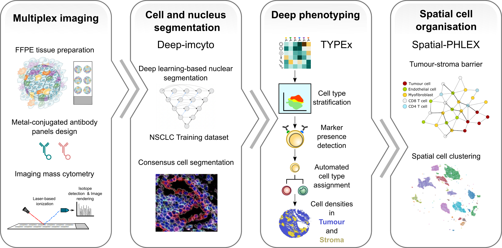

TRACERx-PHLEX: One-stop pipeline for robust multiplexed imaging analyses
===================================

**TRACERx-PHLEX** is a user-friendly pipeline for an end-to-end analysis of multiplex imaging data.

Citations
+++++++++++++++
The pipeline is described in Magness et al. Nature Communications, 2024, doi: 10.1038/s41467-024-48870-5.

Introduction
------------

**TRACERx-PHLEX** is a modular pipeline for comprehensive analysis of the tumour microenvironment using multiplex imaging.

Check out the :doc:`quickstart` section for further information, including :ref:`installation` for how to get started with TRACERx-PHLEX.

TRACERx-PHLEX contains three submodules:

:ref:`PHLEX: deep-imcyto<deep-imcyto>`
---------------------------------------

   A module devoted to performing accurate nuclear and cellular segmentation and single cell measurement in multiplex images.

:ref:`PHLEX: TYPEx<TYPEx_anchor>`
---------------------------------------

   A module for cellular phenotyping from marker expression intensities derived from multiplex images.

:ref:`PHLEX: Spatial-PHLEX<Spatial-PHLEX>`
---------------------------------------

   A module for performing several types of automated spatial analysis.

.. _getting-started:

.. toctree::
   :hidden:
   :caption: Getting started
   :maxdepth: 3

   quickstart

.. _deep-imcyto:

.. toctree::
   :hidden:
   :caption: Deep-imcyto
   :maxdepth: 3

   deep-imcyto

.. _TYPEx:

.. toctree::
   :hidden:
   :caption: TYPEx
   :maxdepth: 1

   TYPEx

.. _Spatial-PHLEX:

.. toctree::
   :hidden:
   :caption: Spatial-PHLEX
   :maxdepth: 2

   spatialPHLEX

.. _guides:

.. toctree::
   :hidden:
   :caption: Guides
   :maxdepth: 2

   guides
